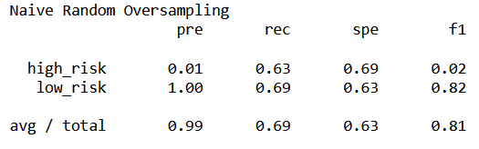
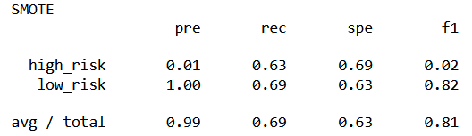
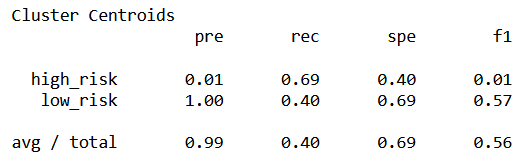
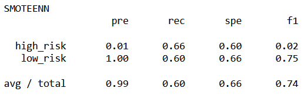
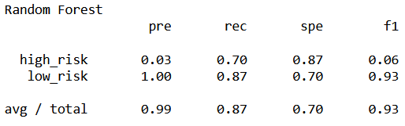
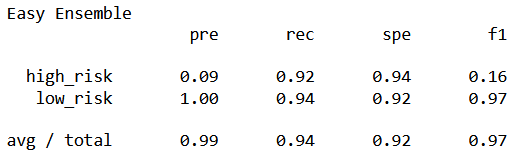

# Loan Risk Prediction Analysis

## Overview
We use the SciKit Learn library for Python to generate several supervised machine learning models in an attempt to assess loan risk.  Due to the inherit class imbalance with credit risk, we tested several different sampling techniques, as well as two ensemble models.

## Results
### Oversampling
Oversampling is a technique to address class imbalance by adding more samples to the smaller population.  With credit assessment, there are many more risky applications than safe applications, so we inflated the high risk population.  We used two oversampling approaches: random oversampling and SMOTE.  Random oversampling randomly selects instances of the minority class and adds them to the population until the classes are balanced.  The Synthetic Minority Oversampling Technique (SMOTE) synthesizes new data points for the minority class, based on the surrounding data points.

### Undersampling
Undersampling reduces the size of the larger population.  Similarly to random oversampling, there is a random undersampling technique, though we did not use it in this project.  Instead, we used a Cluster Centroid approach.  The cluster centroid technique groups the larger population into clusters, then generates a centroid that is the average of that cluster.  

### SMOTEENN
The SMOTEENN approach combines the SMOTE and Edited Nearest Neighbor (ENN) algorithms.  SMOTE first populates the minority class, then ENN cleans the resulting populations.  ENN is an undersampling technique that looks at the two nearest neighbors of a point.  If those neighbors are of different classes, then ENN deletes that point.

### Ensemble Models
Ensemble learning combines several other models, allowing them to grow off of each other.  The Random Forest Model, for example, combines several decision trees into a decision forest.  Each individual tree is simpler, as it is made from a random subset of features instead of attempting to combine all features.  Random forests also allow us to rank features by importance, which can help prevent overfitting or create a simpler future model.  We also used the EasyEnsemble algorithm, which combines AdaBoost learners trained on data balanced by random undersampling.

### Model Assessments
To assess the quality of a model, there are a number of metrics we can look at.  We choose to use accuracy, precision, recall, and F1 scores.  Accuracy is simply the percentage of predictions that were correct.  Precision is the positive predictive value, or how likely a positive result is to be true.  Precision is calculated by dividing the number of true positive results (TP) by the total number of positive results $\frac{TP}{TP + FP}$.  Recall, also known as sensitivity, is a measure of how likely a model will correctly detect a positive result.  Recall is calculated by $\frac{TP}{TP + FN}$.  The F1 score, also called a harmonic mean, is a single summary statistic for precision and recall, calculated by $\frac{2(Precision * Recall)}{Precision + Recall}$. 

* Random Oversampling
  * Accuracy: 0.64386
  * 
* SMOTE Oversampling
  * Accuracy: 0.66289
  * 
* Cluster Centroid Undersampling
  * Accuracy: 0.54473
  * 
* SMOTEENN
  * Accuracy: 0.63097
  * 
* Balanced Random Forest Ensemble
  * Accuracy: 0.78855
  * 
* Easy Ensemble
  * Accuracy: 0.93166
  * 

## Summary
In general, the ensemble methods had higher recall and F1 scores than the single regression methods.  The overall precision for all models was high, and all of the scores we look at trended high for Low-Risk results.  Where our models struggle is accurately identifying High Risk situations.  The high risk precision is low, which means that our models are overzealous and are flagging more results as high risk than they should be.  For credit assessment, we are more concerned with having a high recall, meaning catching as many high risk incidents as possible.  Based on recall, the most reliable model used was the Easy Ensemble algorithm.
